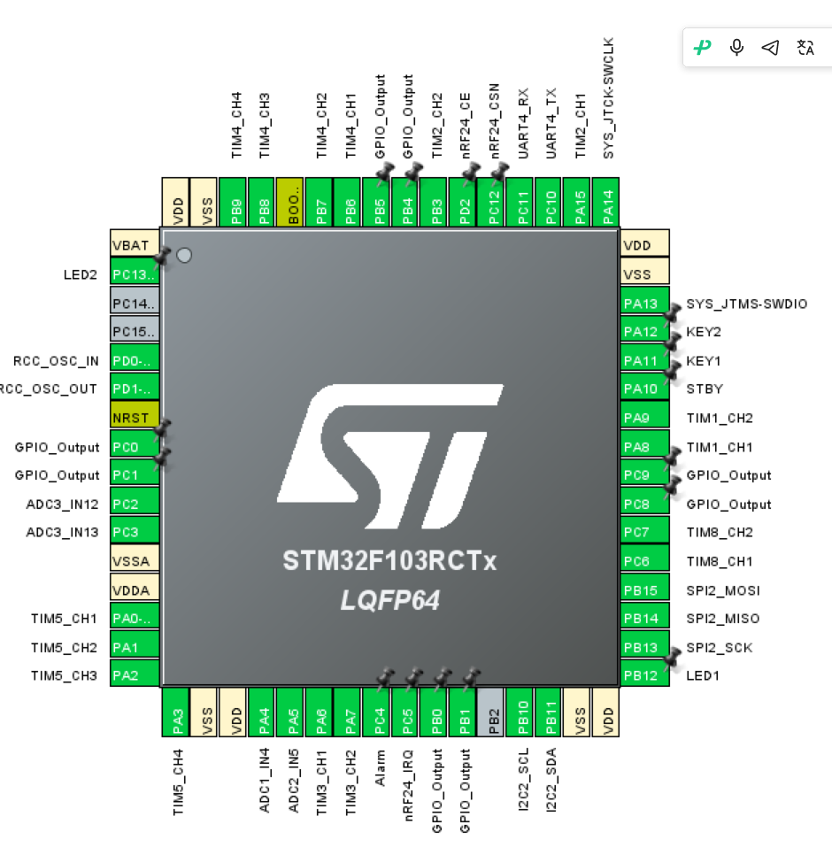

# Control27_Begin

RM 校内赛《机甲夺矿》电控仓库。

- **主控**：STM32F103RCT6（LQFP64，72 MHz，48 KB SRAM，无 FPU）
- **车端工程**：`Hardware/F103RC`（CubeMX 生成 + CMake 工具链 + FreeRTOS CMSIS_V1 五任务框架）
- **遥控器工程**：`Hardware/Remoter`（起步阶段）
- **遥控链路**：nRF24L01P 2.4G 增强型突发（SPI2，硬件 CRC16 + Auto-ACK + 自动重传），弃用 HC-05 蓝牙
- **代码架构**：control-2026 四层（UserApp → Modules → Bsp → Hardware），BSP 层构建中

## CubeMX 引脚分配总览



## 引脚分配明细

### PWM 输出

| 引脚  | 复用功能     | 用途       | 备注                          |
| --- | -------- | -------- | --------------------------- |
| PB6 | TIM4_CH1 | 电机 1 PWM | 20 kHz，3600 级分辨率            |
| PB7 | TIM4_CH2 | 电机 2 PWM |                             |
| PB8 | TIM4_CH3 | 电机 3 PWM |                             |
| PB9 | TIM4_CH4 | 电机 4 PWM |                             |
| PA0 | TIM5_CH1 | 舵机 1 PWM | 50 Hz                       |
| PA1 | TIM5_CH2 | 舵机 2 PWM |                             |
| PA2 | TIM5_CH3 | 舵机 3 PWM |                             |
| PA3 | TIM5_CH4 | 舵机 4（备用） | 暂用 PWM 舵机方案；若结构再加电机，准备走总线舵机 |

**注意，电机序号暂未确定，由硬件根据布线情况最终决定**

### 编码器输入

| 引脚         | 复用功能           | 用途        | 备注                                        |
| ---------- | -------------- | --------- | ----------------------------------------- |
| PA8 / PA9  | TIM1_CH1 / CH2 | 编码器 1 A/B | TI12 四倍频                                  |
| PA15 / PB3 | TIM2_CH1 / CH2 | 编码器 2 A/B | **部分重映射 1**（PA15/PB3 原为 JTAG 引脚，需禁用 JTAG） |
| PB4 / PB5  | TIM3_CH1 / CH2 | 编码器 3 A/B |                                           |
| PC6 / PC7  | TIM8_CH1 / CH2 | 编码器 4 A/B |                                           |

### ADC 采样

| 引脚  | 复用功能      | 用途      | 备注                                                          |
| --- | --------- | ------- | ----------------------------------------------------------- |
| PA4 | ADC1_IN4  | 总电流采样   | ADC1/2 **双同步规则组 + 连续转换 + DMA1_Ch1 循环**（一次读 32 位 DR），55.5 周期 |
| PA5 | ADC2_IN5  | 总电压采样   | 与 PA4 同步采样，功率 = U×I 无相位误差                                   |
| PC2 | ADC3_IN12 | 单关节电流 1 | ADC3 独立慢速轮询                                                 |
| PC3 | ADC3_IN13 | 单关节电流 2 |                                                             |

> 原定 TIM 定时触发 ADC 方案已放弃：F103 的 ADC1/2 规则组触发选择器（EXTSEL）无空闲硬件触发源，改为连续采样 + DMA 读取。

### nRF24L01P 遥控（SPI2）

| 引脚   | 复用功能        | 用途             | 备注                      |
| ---- | ----------- | -------------- | ----------------------- |
| PB13 | SPI2_SCK    | nRF24L01P SCK  | 时钟 4.5 MHz（芯片上限 10 MHz） |
| PB14 | SPI2_MISO   | nRF24L01P MISO |                         |
| PB15 | SPI2_MOSI   | nRF24L01P MOSI |                         |
| PC12 | GPIO_Output | nRF24L01P CSN  | **空闲态必须为高**             |
| PD2  | GPIO_Output | nRF24L01P CE   |                         |
| PC5  | EXTI5（下降沿）  | nRF24L01P IRQ  | 收包中断，可降级 1 ms 轮询        |

### 串口 / 调试

| 引脚   | 复用功能     | 用途     | 备注                                            |
| ---- | -------- | ------ | --------------------------------------------- |
| PC10 | UART4_TX | 调试日志输出 | 115200，**IT 发送 + 环形缓冲（不用 DMA）**          |
| PC11 | UART4_RX | 调试日志输入 | IT 环形缓冲；调试口无协议帧，无需 IDLE 判帧              |
| PA13 | SWDIO    | SWD 调试 | JTAG 已禁用（释放 PA15/PB3/PB4）                     |
| PA14 | SWCLK    | SWD 调试 | ⚠️ TIM2 重映射宏会改写 SWJ_CFG，代码中已做防御（重映射后重新使能 SWD） |

> 2026-09-27 变更：调试串口不再使用 DMA（已释放 DMA2_Ch3/Ch5 与对应中断），UART4 改为纯中断收发。

### GPIO / 其他

| 引脚          | 复用功能             | 用途            | 备注                             |
| ----------- | ---------------- | ------------- | ------------------------------ |
| PB0 / PB1   | GPIO_Output      | 电机方向          | 方向 ×8 之一                       |
| PA6 / PA7   | GPIO_Output      | 电机方向          |                                |
| PC0 / PC1   | GPIO_Output      | 电机方向          |                                |
| PC8 / PC9   | GPIO_Output      | 电机方向          |                                |
| PA10        | GPIO_Output      | 电机驱动 STBY     | TB6612 使能                      |
| PB12        | GPIO_Output      | LED1          |                                |
| PC13        | GPIO_Output      | LED2          | 驱动能力仅 ~3 mA，限流电阻 ≥1 kΩ，建议低电平点亮 |
| PC4         | GPIO_Output      | 蜂鸣器（Alarm）    |                                |
| PA11        | EXTI11（下降沿）      | 按键 KEY1       | 内部上拉                           |
| PA12        | EXTI12（下降沿）      | 按键 KEY2       | 内部上拉                           |
| PB10 / PB11 | I2C2_SCL / SDA   | OLED（SSD1306） | 100 kHz，AF 开漏                  |
| PD0 / PD1   | RCC_OSC_IN / OUT | HSE 8 MHz 晶振  | ×PLL9 = 72 MHz                 |
| PC14 / PC15 | —                | 未使用           |                                |
| PB2         | —                | 未使用（BOOT1）    |                                |

## 构建

```bash
# 依赖：arm-none-eabi-gcc + CMake + Ninja
cmake -S Hardware/F103RC -B Hardware/F103RC/build/Debug -DCMAKE_BUILD_TYPE=Debug
cmake --build Hardware/F103RC/build/Debug
```

## 注意事项

1. **USER CODE 补丁**：`main.c` USER CODE 2 的 `HAL_NVIC_DisableIRQ(DMA1_Channel1_IRQn)`（方案 B 不用 DMA 中断）与 `tim.c` TIM2_MspInit 的 `__HAL_AFIO_REMAP_SWJ_NOJTAG()`（防 SWJ_CFG 被重映射宏改写）必须保留在 USER CODE 段内，重新生成代码不会覆盖。
2. **TIM2 重映射**：PA15/PB3 占用 JTAG 引脚，工程已禁用 JTAG 仅保留 SWD；HAL 的 `AFIO_REMAP_PARTIAL` 宏会将写只读的 SWJ_CFG 写成非法值 0b111（据 ST 社区称新版固件已解决，代码中已做防御性恢复）。
3. 详细审查记录见 `Hardware代码审查报告.md`，ADC 配置步骤见 `ADC方案B配置指南.md`。
4. 器件一定要共地，**一定要共地！！！！！！！！！！**
