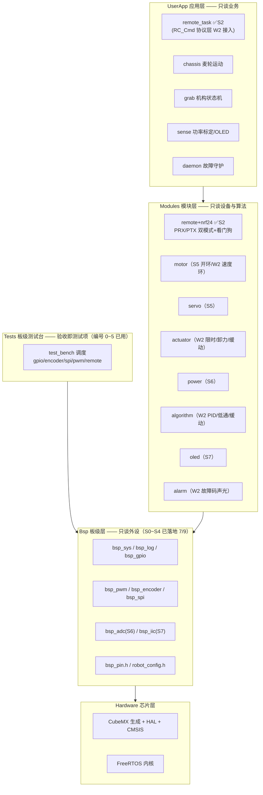

> 配套《机甲夺矿》电控开发计划 v1.0。主控 STM32F103RCT6，血统：control-2026 四层架构。  
> 本文回答规划 3.1 节「沿用 control-2026 四层血统」的具体落地，并附对规划的审视结论。  
> **v1.1 修订（2026-09-30）**：按 BSP 层 S0~S4 验收实况修订——F1 支撑定稿为 CubeMX/HAL 生成、
> `bsp_dwt`→`bsp_sys`、`bsp_usart` 并入 `bsp_log`（UART4 纯中断）、TIM5×4、`robot_def.h` 职能
> 由 `Bsp/robot_config.h` 与各模块头文件承接、**Tests/ 板级测试台纳入架构**、测试板 F103C8_PTX_T 验证一源两板（**遥控器整机 Remoter 独立立项，未生成**）；Modules 清单收敛（power/alarm 立项、dcmotor 更名
> motor、actuator 依赖改 servo）；remote 标注实际冻结形态（字节流链路层，RC_Cmd 协议层移 W2）。
> 实施层排期：姊妹篇《BSP层开发规划》v1.2（S0~S4 已验收）与《Modules层开发规划》v1.0（新增）。

## 〇、审视结论（先行）

规划整体成立：硬约束表已与规则手册原文逐条核对一致（6 kg / 400×400 / 离地 90 mm / 200 Wh·24 V / 载矿 ≤2 / OLED 误差 ±10% / 自制遥控+急停 / 隧道 75 mm+台阶 95 mm / 资源区机构可入底盘不可入）；「限时输出+卸力」保护策略、执行器抽象、遥控链路四原则都是正确方向。以下是审阅中发现、需要在 W1 内消化的问题（W1 已收官，落地状态随条目标注）：

1. **【2026-09-27 勘误】遥控链路更换：HC-05/UART 方案作废，改为 nRF24L01（SPI2 + IRQ=PC5）**。原「HC-05 走 UART4、调试走 UART5」的对调随之简化为：UART4 专职调试口，UART5 引脚 PC12/PD2 释放给 nRF24 的 CSN/CE。**【2026-09-27 二次变更，S0 已落地】UART4 连 DMA 也不用：纯中断收发 + 环形缓冲（`bsp_log`），DMA 控制器仅剩 DMA1_Ch1 服务 ADC（方案 B）**。15 B @ 100 Hz 的射频载荷对 SPI2 无压力。详见规划 2.2 / 六。
2. **control-2026 的 Hardware 层只有 stm32-f4 / stm32-h7，F1 支撑需新建。**【v1.1 定稿】实际以 **CubeMX 生成代码（HAL 库）**落地而非手写标准外设库：`Hardware/F103RC` 即 CubeMX 工程 = CMake 工程根，「只生成不修改」原则改为「生成代码不动，用户代码全部进 USER CODE 段与分层目录」。RCT6 属大容量产品，TIM8 / TIM5 / ADC3 / UART4 在片，外设规划无缺口（2026-09-27 复核通过）。
3. **共享 Cmd 结构体 vs 学长框架的 message_center 发布订阅**：在 48 KB SRAM 上裁剪合理（任务仅 5 个），但并发语义必须写死（见第五章），否则这是最容易埋雷的位置。【v1.1 现状】单写者模型已随 remote_task 落地雏形（帧队列消费）；`RC_Cmd` 结构与快照读法在 W2 随遥控协议层落地（见《Modules层开发规划》§3.8）。
4. ~~CRC8 单字节漏检概率约 1/256，急停帧建议连发 3 帧~~（2026-09-27 勘误：改用 nRF24L01 后链路校验由硬件 CRC16 + Auto-ACK 重传完成，软件层不再做 CRC/SEQ；急停走载荷 FLAGS 位，仍连发）；「急停帧毫秒级 + 遥控器断电看门狗 300~500 ms」的双保险保持不变（看门狗已在 `Remote_IsLinkUp` 落地，实测 400 ms）。
5. 功率换算系数依赖硬件 TBD（采样电阻/运放增益/分压比），而 OLED 显示误差 ≤±10% 是检录硬项——系数必须全部收进 robot_config.h 并预留标定宏。【v1.1】`ROBOT_POWER_V_K/I_K` 占位已就位，S6 随 Modules/power 标定。
6. RCT6 只有 48 KB SRAM，5 任务栈 + 环形缓冲 + 协议缓冲需要预算，W1 就用 uxTaskGetStackHighWaterMark 做一次栈普查并记入日志。【v1.1】已完成且优于原设想：栈高水位**常驻测试台心跳**（App_TestBench_T 每 2s 自证），非一次性普查。
7. 遥控器端架构未定义：建议遥控器直接复用本框架。【v1.1 定稿 + 2026-09-30 勘误】「一源两板」路线已由**测试发送板**验证：`Hardware/F103C8_PTX_T`（F103C8，SPI1，CSN=PB1/CE=PB0/IRQ=PB10）是 nRF24 链路的**专用测试板**（双板联调/载波测试/频偏扫描/角色互换），**不是遥控器**——通过 `CONFIG_REMOTE_UNIT` 编译开关复用同一份 Bsp+remote 源码；**遥控器整机独立立项 `Hardware/Remoter`（现仅 .ioc 未生成）**，W2 生成后按同模式（独立工程 + CONFIG_REMOTE_UNIT）展开，不单独起架构。

## 一、总体分层

四层单向依赖，上层可调用下层，下层对上层不可见；Tests/ 测试台与 UserApp 平行消费 Bsp/Modules（验收即测试项，常驻主干，规范见《BSP层开发规划》§十）：



## 二、目录结构

【v1.1】按实际落地形态修订（Bsp 平铺、robot_config.h 归 Bsp、新增 Tests/ 与双工程；原 `robot_def.h` 不再单设——「参数集中」职能由 `Bsp/robot_config.h` 承担，「共享类型」职能由各模块头文件承担，跨板载荷结构在 `Modules/remote/remote.h`）：

```text
RM_Begin/                     ← 仓库根（CMake 门面 CMakeLists.txt + CMakePresets.json）
├── Bsp/                      # 片上外设封装（平铺，不设子目录——模块少，CMake GLOB_RECURSE 收集）
│   ├── bsp_pin.h             # 全部引脚/重映射/JTAG 禁用唯一硬件地图（GpioPin_t 复合类型）
│   ├── robot_config.h        # 全局可调参数 + 编译开关（CONFIG_REMOTE_UNIT / ROBOT_TEST_BENCH）
│   ├── bsp_sys.c/.h          # ✅S0 DWT 时基：Bsp_Init/GetUs/GetMs/DelayUs（原规划 bsp_dwt 落点）
│   ├── bsp_log.c/.h          # ✅S0 UART4 纯中断收发 + 环形缓冲 + printf 重定向（原规划 bsp_usart 并入）
│   ├── bsp_gpio.c/.h         # ✅S1 Gpio_Set/Reset/Read + Exti_Attach 回调注册（IRQ 注入唯一通道）
│   ├── bsp_pwm.c/.h          # ✅S4 TIM4×4 20kHz + TIM5×4 50Hz，统一通道号 1..8
│   ├── bsp_encoder.c/.h      # ✅S3 TIM1/2/3/8 增量/累计
│   ├── bsp_spi.c/.h          # ✅S2 SPI2 4.5MHz 全双工 + CSN/CE 电平
│   ├── bsp_adc.c/.h          # S6：ADC1/2 双同步 DMA 循环 + ADC3 扫描
│   └── bsp_iic.c/.h          # S7：I²C2 阻塞读写带超时
├── Modules/
│   ├── remote/               # ✅S2 nrf24_defs.h/nrf24.c（寄存器级）+ remote.h/.c（链路层）
│   ├── motor.c/.h            # S5：TB6612 方向+STBY+duty（开环）；W2 加速度环
│   ├── servo.c/.h            # S5：角度映射/软限位/卸力
│   ├── actuator.c/.h         # W2：电流堵转/累计供电热保护/卸力/缓动（规划 5.1/5.2 载体，无反馈开环保护）
│   ├── power.c/.h            # S6：ADC 原始值→V/I/P 换算（窗口均值+标定宏）
│   ├── algorithm/            # W2：PID/一阶低通/缓动/clamp（纯 C 无硬件依赖）
│   ├── oled.c/.h             # S7：SSD1306 驱动 + 排版刷新
│   └── alarm.c/.h            # W2：故障码→蜂鸣器+LED 状态码
├── UserApp/
│   ├── remote_task.c         # ✅S2 PRX 服务循环 + 1Hz 统计（RC_Cmd 协议层 W2 在此接入）
│   └── （chassis/ grab/ sense/ 二期；建任务由 CubeMX freertos.c 承担，不另设 os_task.c）
├── Tests/                    # ✅S2 板级测试台：验收即测试项、常驻主干（test_bench 调度 + 5 项）
├── Hardware/
│   ├── F103RC/               # 车端 CubeMX 工程 = CMake 工程根（CMSIS+HAL+FreeRTOS 不动）
│   ├── F103C8_PTX_T/         # ✅S2 nRF24 测试发送板（链路诊断专用，非遥控器；CONFIG_REMOTE_UNIT 复用源码）
│   └── Remoter/              # 遥控器整机（仅 .ioc 未生成；按同模式独立工程 + CONFIG_REMOTE_UNIT 展开）
└── docs/                     # 本架构 v1.1 + BSP 层规划 v1.2 + Modules 层规划 v1.0
```

遥控器整机（Remoter）为同仓库第二个业务工程（复用 Bsp/Modules，`CONFIG_REMOTE_UNIT` 区分），不单独起架构；F103C8_PTX_T 为链路测试板，不承担业务。

## 三、各层职责与模块清单

### 3.1 Hardware（芯片支撑）

CubeMX 生成代码（Core/Drivers/Middlewares）+ 启动文件 + FreeRTOS 内核。本层文件「只生成不修改」——升级由 CubeMX 重新生成，用户代码全部置于 USER CODE 段与分层目录；禁止任何业务与板级知识渗入。【v1.1】CMake 以仓库根 `CMakeLists.txt` 为门面 `add_subdirectory(Hardware/F103RC)`，分层目录用 `CMAKE_CURRENT_LIST_DIR` 定位（CLion 预设 profile 双窗口开根工程与测试工程）。

### 3.2 Bsp（板级支持）

原则：最薄封装、一个外设一个模块、不知业务。所有引脚与重映射（含 TIM2 PartialRemap1、JTAG Disable、编码器 2 的 PA15/PB3）只允许出现在 bsp_pin.h。【v1.1 状态】S0~S4 七个模块验收通过，仅剩 bsp_adc（S6）与 bsp_iic（S7）；API 细节以《BSP层开发规划》§四为准，下表列实际冻结形态。

2026-09-26 勘误（ADC 触发方案，定稿方案 B）：F103 的 ADC1/2 规则组触发源（EXTSEL）仅有 T1_CC1/CC2/CC3、T2_CC2、T3_TRGO、T4_CC4、EXTI11（重映射后 = TIM8_TRGO）与软件启动，不含 TIM7 TRGO 档；且上述硬件触发源在本工程已被编码器（TIM1/2/3/8）、电机 PWM（TIM4_CC4）与按键（PA11 = EXTI11）全部占用。故 bsp_adc 定稿为：ADC1/2 双同步规则组 + 连续转换 + DMA1_Ch1 循环搬运，sense_task 随时读最新值、按固定样本数窗口平均；TIM7 保留为 1 kHz 通用节拍定时器（可选），不再承担 ADC 触发。详见工作区《Hardware代码审查报告.md》与《ADC方案B配置指南.md》。

**2026-09-27 二次变更：调试口 UART4 不再使用 DMA**（已释放 DMA2_Ch3/Ch5 及对应中断），改为纯中断收发 + 环形缓冲；调试口无协议帧，"DMA 循环 + IDLE 判帧"字样作废。DMA 控制器现仅剩 DMA1_Ch1 服务 ADC（方案 B）。

| 模块 | 状态 | 外设/资源 | 关键实现点（实际冻结形态） |
| --- | --- | --- | --- |
| bsp_sys（原规划 bsp_dwt） | ✅S0 | DWT CYCCNT | `Bsp_Init` 最早初始化 / `Bsp_GetUs`（71.6min 回绕）/ `Bsp_GetMs` / `Bsp_DelayUs`（>1ms 用 osDelay）；教训：实例宏≠HAL 句柄，一律 `&htimx` 形态 |
| bsp_log（原规划 bsp_usart 并入） | ✅S0 | UART4 115200 纯中断 | `Log_Printf`（TX 队列，满则丢不阻塞）/ `Log_Poll`（RX 256B 环形缓冲）/ printf 重定向；无 DMA、无 IDLE 判帧（09-27 二次变更定稿） |
| bsp_gpio | ✅S1 | 方向×8 / STBY / LED×2 / 按键×2 / 蜂鸣器 / CSN·CE | `GpioPin_t` 复合引脚类型 + `Gpio_Set/Reset/Read`；`Exti_Attach(pin, cb)` 回调注册是全部 EXTI 行为注入的唯一通道，回调仅 osSignalSet 级操作 |
| bsp_pwm | ✅S4 | TIM4×4（20kHz 电机）/ **TIM5×4**（50Hz 舵机，CH4 启用） | 统一通道号 `PWM_20K_CH1..4`(1..4) / `PWM_50HZ_CH1..4`(5..8)；`Pwm_SetDuty(ch, float 0..1)`（NaN/负值落安全态，防整数档量化损耗）/ `Pwm_SetPulseUs`（仅 50Hz 组，钳 0..20000us）/ `Pwm_Release`（compare=0，可直恢复）；Init 后 0 输出=上电安全链，不依赖上层调用顺序 |
| bsp_encoder | ✅S3 | TIM1/2/3/8 编码器模式 | TIM2 部分重映射1 + SWJ 防御固化；16 位回绕差分扩展 int32；`Encoder_Read`（增量）/ `Encoder_GetCount`（累计） |
| bsp_spi | ✅S2 | SPI2（PB13/14/15）→ nRF24L01，**4.5 MHz**（APB1 36M/8，09-29 勘误） | `Spi_Transfer/TransferByte`（10ms 超时）/ `Spi_Csn/Spi_Ce`（委托 bsp_gpio）/ `Spi_IsReady`；CSN/CE 时序知识归 Modules/remote |
| bsp_adc | S6 | ADC1_IN4+ADC2_IN5 双同步 + ADC3_IN12/13 | DMA 32 位字拆分（低 16=ADC1 电流 / 高 16=ADC2 电压）；启动后丢前 2 窗口样本；窗口均值样本数进 robot_config.h |
| bsp_iic | S7 | I2C2（PB10/PB11）100kHz → OLED | 读写带超时；连续失败触发总线恢复（DeInit→Init），禁止死等 |

### 3.3 Modules（设备与算法）

原则：面向接口编程、可脱离整车单独测试；模块间不互相 include。【v1.1】唯一登记例外：**actuator → servo**（保护策略包装器件层，单向；理由与接口见《Modules层开发规划》§3.3）。清单收敛说明：dcmotor 更名 **motor**（对齐 BSP 规划 v1.1 与目录现状）；**power** 自 sense_task 上浮为本模块（换算可脱离整车测试、标定点唯一）；**alarm** 立项（daemon 的执行端）；原表 remote 的 `RC_Cmd_GetCopy` 移至 W2 遥控协议层。

| 模块 | 状态 | 职责 | 对上接口 | 依赖 |
| --- | --- | --- | --- | --- |
| remote（+nrf24） | ✅S2 | nRF24 器件驱动 + 链路层：PRX/PTX 双模式、IRQ 服务、看门狗、诊断计数 | `Remote_Init(mode)` / `Remote_Service` / `Remote_ReadPacket` / `Remote_SendPacket` / `Remote_IsLinkUp` / GetRx·TxFailCount | bsp_spi, bsp_gpio, bsp_sys, cmsis_os（授权例外）；W2 增 RC_Cmd 协议层 |
| motor | S5/W2 | TB6612 ×4：方向+STBY+duty 开环（S5）→ 速度环（W2，依赖 algorithm） | `Motor_SetDuty(ch,-1000..+1000)` / `Motor_Enable/Disable`；W2 加 `Motor_SetSpeedRpm/GetSpeedRpm` | bsp_pwm, bsp_gpio, bsp_encoder；速度环加 algorithm |
| servo | S5 | 舵机 ×4 两类分型（大臂/小臂=数字 fail-hold：发一次锁存、停脉冲≠卸力；手腕/爪子=SG90 模拟：停脉冲=真卸力；爪子器件已定案 SG90，360° 方案作废）：脉宽↔角度、软限位、Release 能力表 | `Servo_InitAll/SetAngle/Release/ReleaseCutsPower` | bsp_pwm |
| actuator | W2 | 执行器保护策略（**无位置反馈+器件分型+业务拍板**：数字大臂/小臂=电流判据触发即报警（fail-hold 软件无法卸力）；爪子 SG90=热保护→grab 拍板停脉冲；手腕全程保持=热保护禁用、仅报警兜底）：电流堵转/热保护/卸力/缓动恢复 | `Act_Init/SetTarget/Update/Release/IsSettled/IsStalled/NeedsCooldown` | **servo**（登记例外）, algorithm |
| power | S6 | 功率采样换算：窗口均值 + 标定宏，换算点全系统唯一 | `Power_GetVoltage/Current/Power` / `Power_GetJointCurrent(k)` | bsp_adc |
| algorithm | W2 | PID（**移植自 control-2026 controller，去 arm_math 适配**）/ 一阶低通 / 缓动轨迹 / clamp；纯 C 可 PC 单测 | 纯函数 | 无（PID 内部 dt 自算用 bsp_sys） |
| oled | S7 | SSD1306 驱动与排版；功率/电压/电流/电量四项（检录项） | `Oled_Init` / `Oled_Printf(x,y,...)` / `Oled_Refresh` | bsp_iic |
| alarm | W2 | 故障码 → 声光（蜂鸣器节奏 + LED 状态码），非阻塞 | `Alarm_Set(code)` / `Alarm_Poll` | bsp_gpio |

### 3.4 UserApp（应用）

原则：应用平行、互不 include；只通过各模块头文件与 robot_config.h 共享类型；每任务用 DWT 统计实际周期，超期打 LOGERROR。【v1.1】建任务入口由 CubeMX `freertos.c` 承担（含新增 App_TestBench_T）；跨板载荷结构 `#pragma pack(1)` 置于 remote.h。

| 任务 | 周期 | 优先级 | 输入 | 输出 | 状态 |
| --- | --- | --- | --- | --- | --- |
| remote_task | IRQ 驱动 + 20ms 兜底（实际实现） | 高 | nRF24 RX FIFO（SPI2 读取） | 帧队列 → W2 起 RC_Cmd（唯一写者） | ✅S2（业务形态） |
| chassis_task | 1~2 ms | 高 | RC_Cmd 快照 | 4×目标转速 → motor | W2 |
| grab_task | 10~20 ms | 中 | RC_Cmd 快照 | Act_SetTarget；状态机推进 | W2 |
| sense_task | 20~50 ms | 低 | **Modules/power 换算结果** | 排版 → oled | W2（换算已上浮 power） |
| daemon_task | 100 ms | 低 | 各模块心跳 | 故障码 → alarm；喂独立看门狗 | W2 |
| App_TestBench_T | 10ms Poll / 2s 心跳 | Normal | ROBOT_TEST_BENCH 选择 | 测试项输出 + 栈高水位自证 | ✅S2 |

## 四、层间依赖规则（强制，commit 前自查）

1. 单向：UserApp → Modules → Bsp → Hardware。禁止反向 include，禁止跨层（grab.c 不得 include bsp_*.h）。
2. 同层互不 include；**登记例外：actuator → servo**（v1.1，单向、策略包装器件）。共享类型不单设 robot_def.h——可调参数进 `Bsp/robot_config.h`，模块类型在各模块头文件；跨板通信结构体用 `#pragma pack(1)`（remote.h）。
3. Bsp 层禁词：底盘、舵机、抓取、矿——板级层不允许出现业务概念。
4. 中断回调只做搬运：ISR 内只写环形缓冲/置标志（osSignalSet 级），帧解析、状态机一律在任务上下文完成。
5. 参数集中：机械参数/限位/PID/看门狗时长/协议参数全部进 robot_config.h，引脚进 bsp_pin.h，换车只改配置。
6. 上电安全顺序：BSPInit → 执行器统一先发中位再使能（规划坑 5）→ 创建任务 → 开中断。【v1.1 强化】bsp_pwm/bsp_gpio 的 0 输出/低电平复位态已内建，安全链不依赖上层调用顺序。
7. **Tests 边界（v1.1 新增）**：验收即测试项、常驻主干、编号只增不改；测试台激活时业务任务 `TestBench_Yield` 让位；业务逻辑禁止进 Tests/，诊断打印禁止进 UserApp/。

## 五、数据流与并发设计

### 5.1 RC_Cmd 并发语义（本架构最重要的三行字）

- 唯一写者：remote_task（帧解析成功时）；看门狗超时是第二写者（写失效值）。
- 唯一读法：RC_Cmd_GetCopy(&snap)——关调度（或 BASEPRI 屏蔽）内 memcpy 快照，读者绝不直接引用全局结构体字段（vx/vy/omega 三字段非原子，直读会撕裂）。
- 故障语义两级：link_timeout（300 ms 渐停，指令向零衰减，防甩矿）与 estop（立即零输出+制动）。应用层只看 valid / estop 两个位。

【v1.1 现状】W1 落地的是链路层字节流形态（`Remote_ReadPacket` 帧队列 + `Remote_IsLinkUp` 看门狗），上述三条并发语义在 W2 随遥控协议层落地（见《Modules层开发规划》§3.8），落地前 chassis/grab 不得开环跑整车。

### 5.2 全链路数据流

```text
遥控器[100Hz 固定周期, 摇杆低通, 急停帧]
→ nRF24L01 (2.4G 增强型突发: 硬件 CRC16 + Auto-ACK + 自动重传)
→ SPI2 读 RX FIFO (IRQ=PC5/EXTI5 收包, 20ms 兜底轮询)
→ remote_task:   帧队列 → (W2) RC_Cmd(唯一写者) → 看门狗续期
→ chassis_task(1~2ms):  RC_Cmd_GetCopy → 麦轮逆解 → motor 速度环 → bsp_pwm TIM4
→ grab_task(10~20ms):   RC_Cmd_GetCopy → 机构状态机 → Act_SetTarget
                        → actuator(电流堵转/热保护/卸力/缓动) → servo → bsp_pwm TIM5
→ sense_task(20~50ms):  power(V/I/P 换算) → OLED 排版刷新
→ daemon_task(100ms):   各模块心跳/故障码 → alarm；喂独立看门狗
```

## 六、W1 冻结的三个头文件

【v1.1 结案】remote.h 已按实际形态冻结（字节流链路层，器件知识不出模块）；dcmotor/actuator 头文件未在 W1 冻结，接口定稿移交《Modules层开发规划》§3（S5 先交付开环与器件层，W2 冻结策略层）。

```c
/* remote.h —— 已冻结 ✅S2（实际形态；原草案的 RCPayload/RC_Cmd 协议结构移 W2 §3.8） */
bool Remote_Init(RemoteMode_t mode);   /* PTX/PRX 双模式；服务任务上下文调用（谁 Init 谁服务） */
void Remote_Service(void);             /* PRX：等 IRQ 信号 + FIFO 搬运入队；PTX：20ms 节拍 */
bool Remote_ReadPacket(uint8_t *buf, uint8_t size);    /* 取一帧（队列满丢最旧） */
bool Remote_SendPacket(const uint8_t *buf, uint8_t size); /* 阻塞至 ACK 或重传耗尽 */
bool Remote_IsLinkUp(void);            /* 看门狗：400ms 无帧 = false（上层须安全停机） */
uint32_t Remote_GetRxCount(void);      /* 诊断计数（收包率/丢包统计） */
uint32_t Remote_GetTxFailCount(void);
```

```c
/* motor.h（原 dcmotor.h）—— W2 冻结；S5 先交付开环半（接口骨架，详见 Modules 规划 §3.1） */
/* S5：Motor_Init / Motor_SetDuty(ch,-1000..+1000) / Motor_Enable / Motor_Disable        */
/* W2：Motor_SetSpeedRpm(ch,rpm) / Motor_GetSpeedRpm(ch)（内嵌 PID，algorithm 就绪后填） */
```

```c
/* actuator.h —— 规划 5.1 接口 + 保护内建；W2 冻结。
   【2026-10-01 勘误】PWM 舵机无位置反馈：is_arrived 不成立 → is_settled（开环假定）；
   【二次修正】MOVING 时长=指令斜坡 T_move 是确定性事件，"运动超时"判据不存在。
   【三次修正】器件分型决定保护能力：数字舵机（大臂/小臂，fail-hold）停脉冲≠卸力、锁存后恒供电
   （热保护无意义），唯一真判据=电流，触发后软件只能报警；SG90（手腕/爪子，模拟）停脉冲=真卸力、
   热保护有效。详见 Modules 规划 §3.3 保护矩阵 */
typedef struct Actuator {
    ActType  type;                 /* SERVO / 预留 */
    void    *hw;                   /* servo 通道上下文（经 servo 层，不直连 bsp_pwm） */
    float    min_deg, max_deg;     /* 软件限位 < 机械限位（保守 5~10°） */
    float    target_deg, cur_deg;
    float    ease_dps;             /* 缓动限速 100~150 °/s；斜坡时长 T_move=|Δ|/ease_dps 纯指令侧可算 */
    uint32_t energize_window_ms, energize_max_ms, cooldown_ms;  /* 供电热保护（仅 SG90 实例，数字实例置 0 禁用） */
    float (*get_current_a)(void);  /* 电流源注入（数字大舵机实例必配；SG90 实例 NULL） */
    void (*set_target)(struct Actuator *self, float deg);
    void (*release)  (struct Actuator *self);        /* SG90：真卸力；数字舵机：停脉冲+故障态（fail-hold 仍锁存） */
    bool (*is_settled)(const struct Actuator *self);   /* 开环：指令斜坡走完（非实测到位） */
    bool (*is_stalled)(const struct Actuator *self);   /* 电流判据触发（数字实例） */
    bool (*needs_cooldown)(const struct Actuator *self); /* 热保护超限（软模式，业务择机卸力） */
} Actuator;

void Act_Init(Actuator *a, const ActConfig *cfg);
void Act_SetTarget(Actuator *a, float deg);    /* 重算斜坡（T_move 纯指令侧可算），缓动转进 */
void Act_Update(Actuator *a, uint32_t now_ms); /* grab_task 周期调：斜坡/电流判据/供电累计/卸力/缓动 */
```

## 七、与 control-2026 的移植差异

| 项 | control-2026 | 本赛方案 | 理由 |
| --- | --- | --- | --- |
| 芯片支撑 | Hardware/stm32-f4、stm32-h7 | **CubeMX 生成 Hardware/F103RC（HAL）**【v1.1 定稿】 | 主控 STM32F103RCT6；生成即正确，手写库收益低 |
| 应用间通信 | message_center 发布/订阅 | 共享 Cmd 结构体 + 快照拷贝 | 48 KB SRAM 裁剪；仅 5 个任务，无多源指令汇聚需求 |
| 电机模块 | DJMotor / CAN 电调 | motor（PWM + TB6612 + 编码器）【v1.1 更名】 | 执行器体系整体不同 |
| robot_cmd 大脑 | 独立 robot_cmd 应用做指令映射 | 收敛进 remote 模块 + 各应用自映射 | 单板单链路（仅遥控器一个指令源），无需独立大脑应用 |
| 串口接收 | DMA + IDLE（F4 有 DMA） | **UART4 纯中断 IT + 环形缓冲（bsp_log）**【v1.1 定稿，09-27 二次变更】 | 调试口无协议帧；DMA2 全释放给未来扩展 |
| 遥控器 | DR16 接收机 | 自制遥控器（nRF24L01 发送端）= **Hardware/Remoter** 独立工程（未生成，W2 展开），复用 Bsp+remote 源码 + CONFIG_REMOTE_UNIT；**F103C8_PTX_T 是链路测试板（已落地）非遥控器**【v1.1 勘误】 | 规则 3.2.2 自制遥控器硬性要求 |

## 八、TBD 的架构挂钩

- 结构组 TBD（臂长/限位角/自重）→ 全部落 robot_config.h；IK 若启用放 Modules/algorithm，grab 状态机接口不变。
- 操作手 TBD（分关节 vs 末端联动）→ robot_config.h 一个编译开关切指令映射，不动下层。
- 硬件 TBD（采样电阻/增益/基准）→ robot_config.h 标定宏，Modules/power 换算点唯一（v1.1：自 sense_task 上浮），OLED ±10% 检录项直接受益。
- 【v1.1】电机序号未定（硬件布线决定）→ `robot_config.h` 通道映射表一处改，Modules 不写死。

## 九、W1 落地顺序（收官结算，2026-09-30）

1. ✅ CMake 工程骨架 + CubeMX 空任务跑通（72 MHz 时钟树确认；根 CMakeLists 门面 + 预设 profile）。
2. ✅ bsp_sys（原 bsp_dwt）/ bsp_gpio / bsp_log / bsp_encoder / bsp_pwm / bsp_spi——形态有修订（log 并 usart、纯中断无 DMA、TIM5×4、float duty），S0~S4 全部板端/示波器验收通过。
3. ✅ remote 模块双板联调（W1 验收：PRX 100pkts/s、收包率 100%>95%、seq 连续、看门狗 400ms 内 link=0；频道 ch90=2490MHz 避 WiFi；nRF24 三处手册级修复沉淀进《BSP层开发规划》§十）。**RC_Cmd 并发语义未含在内，移 W2 §3.8——车端闭环控制开跑前的硬前置。**
4. ✅ nRF24 测试发送板 F103C8_PTX_T 落地并完成角色互换/频偏扫描/载波测试四件诊断（**勘误 2026-09-30：它是链路测试板，不是遥控器**）；遥控器整机 Remoter 待 W2 生成后按同模式展开。
5. ⏸ dcmotor/actuator 头文件未冻结——接口定稿移交《Modules层开发规划》，S5 先交付开环/器件层。
6. ✅ 栈高水位常驻测试台心跳（优于一次性普查，App_TestBench_T 每 2s 自证并随日志输出）。

---
编制：2026-09-27（v1.0，配套《机甲夺矿》电控开发计划 v1.0）| v1.1 修订：2026-09-30（依据 BSP S0~S4 验收实况）
姊妹篇：《BSP层开发规划》v1.2（实施细则 + 测试台规范 §十）、《Modules层开发规划》v1.0（L3 排期与接口定稿）
